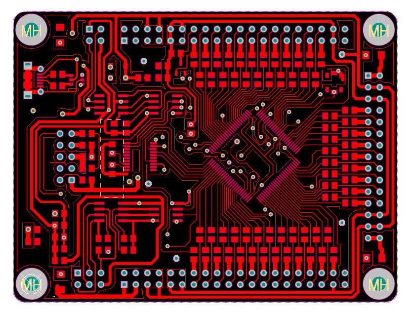
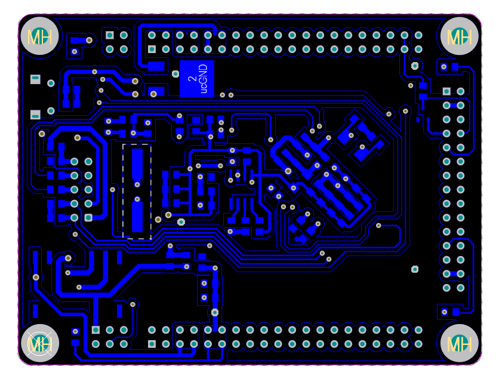
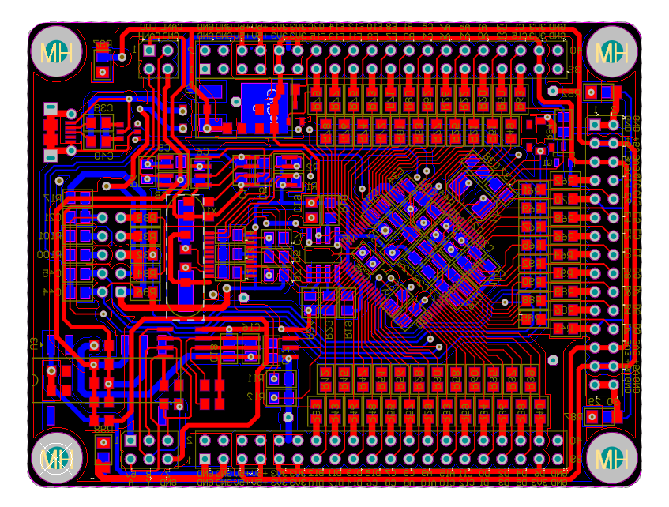
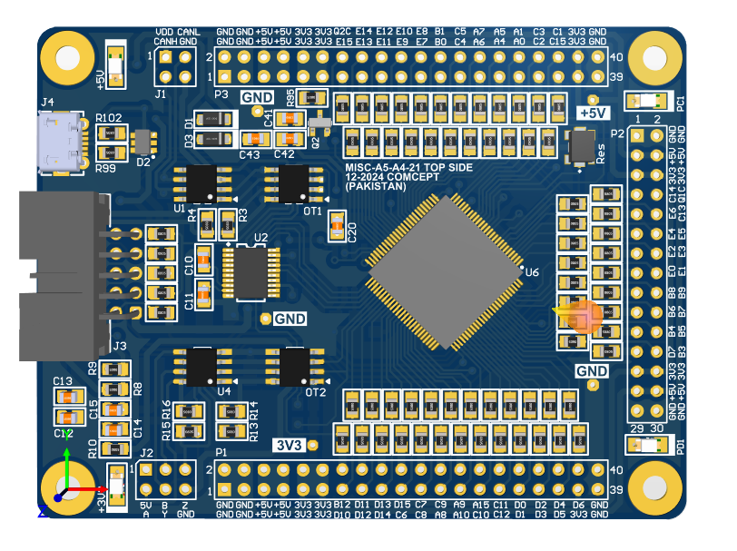
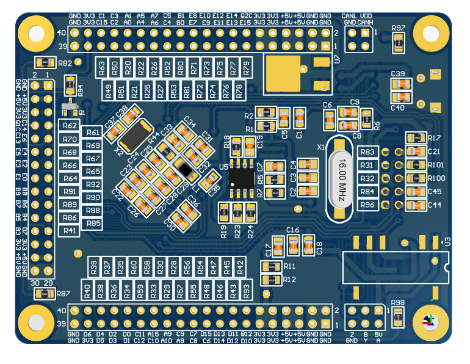
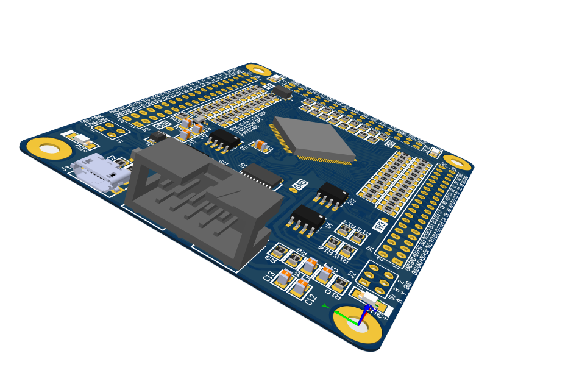

# STM32 CAN Bus Shield

A custom-designed CAN bus shield built around an STM32F429 and a Microchip MCP2515 standalone CAN controller. The idea is basically the same as the classic Arduino CAN shield, just redesigned around STM32F429 instead, so it has more processing headroom for actual embedded development work. This repo has the full PCB design along with the STM32CubeIDE firmware project and a lightweight MCP2515 driver.

The focus of this repo is mainly the PCB, custom layout, routing, and hardware design decisions. The firmware and driver are included and working, but this page won't go too deep into the driver internals.

## Hardware

- STM32F429 as the main controller
- MCP2515 standalone CAN controller, connected over SPI
- CAN transceiver for the actual bus interface
- Custom shield-style PCB, designed in Altium Designer

## PCB design

Designed in Altium Designer as a compact shield-form-factor board for STM32-based CAN development.

**Top layer**
<p align="center">

</p>

**Bottom layer**
<p align="center">

</p>

**2D layout**
<p align="center">

</p>

**3D top view**
<p align="center">

</p>

**3D bottom view**
<p align="center">

</p>

**Isometric view**
<p align="center">

</p>

## About the MCP2515

The MCP2515 is a standalone CAN 2.0B controller that talks to the host MCU over SPI, paired here with a CAN transceiver to interface with the actual bus. It handles the CAN protocol side (arbitration, error handling, message filtering) so the STM32 just needs to configure it and move messages in and out over SPI. The driver in this repo covers initialization, mode configuration (normal, listen-only, sleep, configuration mode), register-level SPI access, and CAN transmit/receive.

## Repository Structure

```text
.
├── Core/
│   ├── Inc/
│   │   └── ...
│   └── Src/
│       ├── main.c
│       ├── CANSPI.c
│       ├── MCP2515_CAN.c
│       └── ...
├── Drivers/
├── Startup/
│   └── ...
└── README.md
```

## Development environment

STM32CubeIDE, STM32 HAL, Altium Designer for the PCB.

## Tested on

Customized Can Shield with Cangroo.

## License

MIT.
